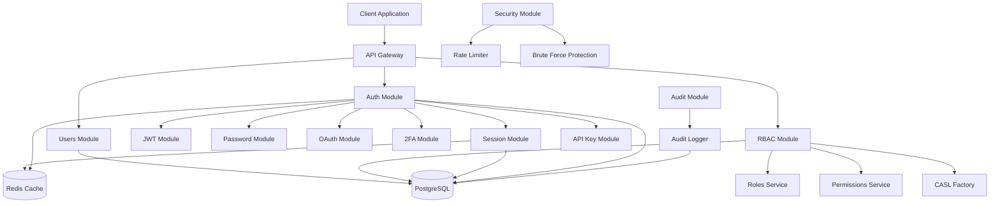
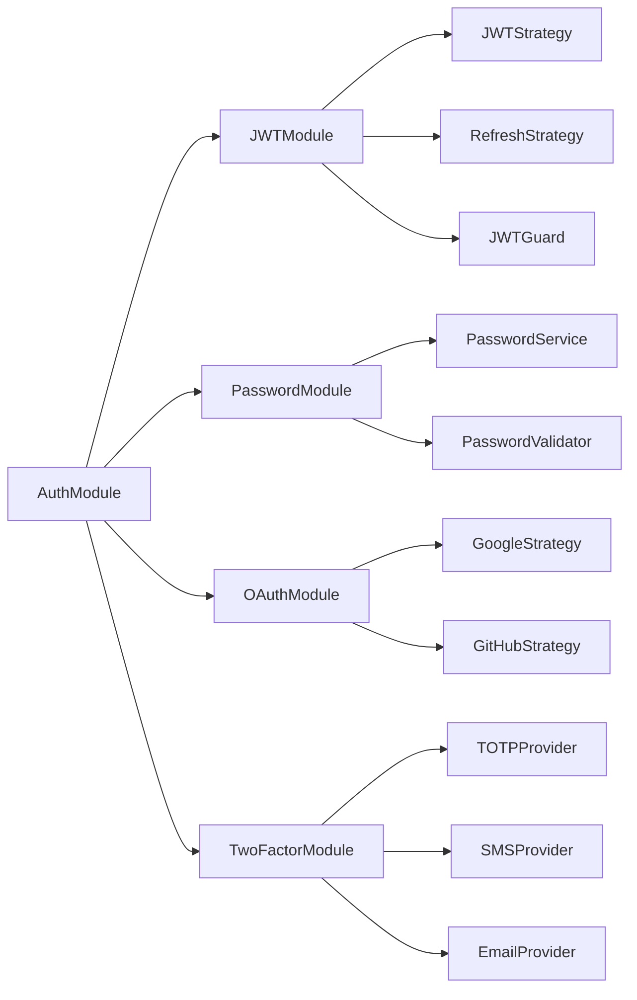
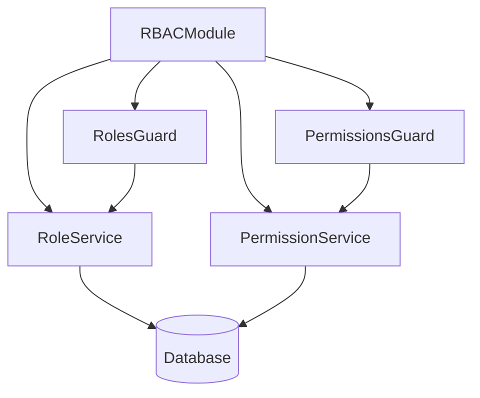
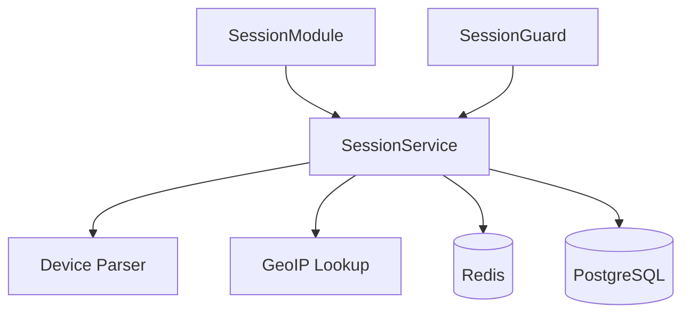
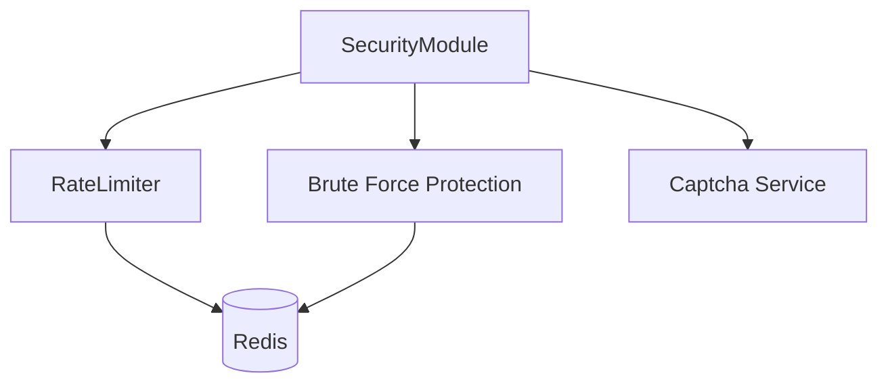
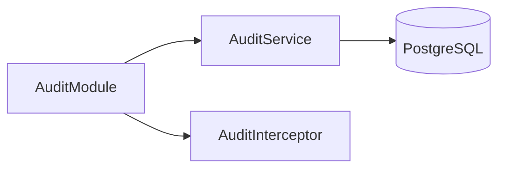
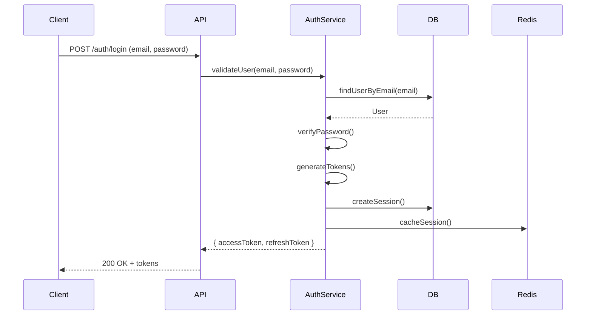
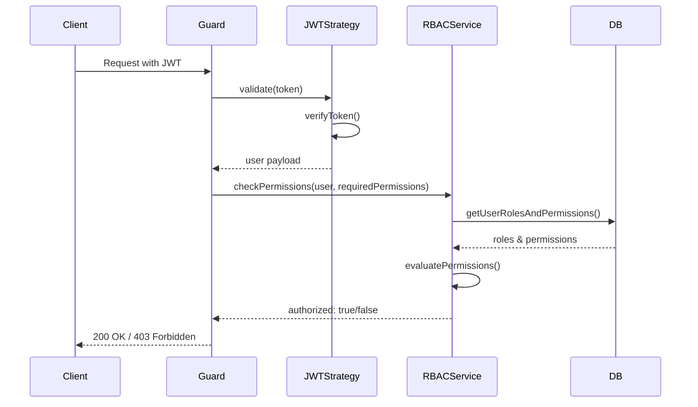
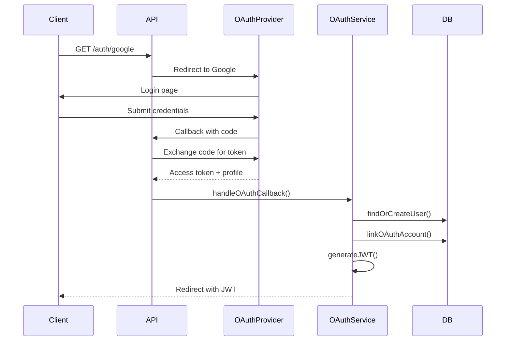
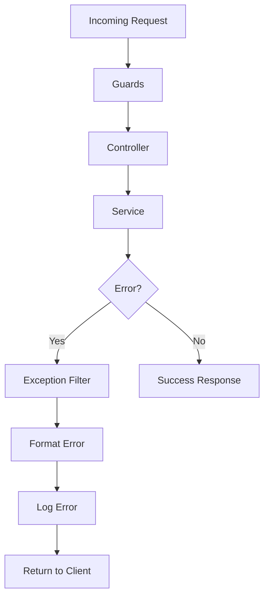

# Architecture Documentation

System architecture overview for the Auth Starter Kit.

## Overview

The Auth Starter Kit follows a **modular monolith** architecture using NestJS. It's designed to be:
- **Modular**: Each feature is self-contained
- **Scalable**: Easy to extract modules to microservices later
- **Maintainable**: Clear separation of concerns
- **Extensible**: Simple to add new features

## High-Level Architecture



## Project Structure

```
src/
├── main.ts                          # Application entry point
├── app.module.ts                    # Root module
│
├── config/                          # Configuration
│   ├── database.config.ts          # TypeORM configuration
│   ├── redis.config.ts             # Redis/Cache configuration
│   ├── jwt.config.ts               # JWT settings
│   ├── security.config.ts          # Security settings
│   └── validation/
│       └── env.validation.ts       # Environment validation
│
├── database/                        # Database layer
│   ├── entities/                   # TypeORM entities
│   ├── migrations/                 # Database migrations
│   ├── seeds/                      # Data seeders
│   └── subscribers/                # Entity subscribers
│
├── modules/                         # Feature modules
│   ├── auth/                       # Authentication
│   │   ├── jwt/                    # JWT strategy
│   │   ├── password/               # Password auth
│   │   ├── oauth/                  # Social auth
│   │   └── two-factor/             # 2FA
│   │
│   ├── rbac/                       # Authorization
│   │   ├── decorators/             # @RequirePermissions, @Roles
│   │   ├── guards/                 # Authorization guards
│   │   └── casl/                   # ABAC with CASL
│   │
│   ├── users/                      # User management
│   ├── session/                    # Session management
│   ├── api-keys/                   # API key management
│   ├── security/                   # Security features
│   └── audit/                      # Audit logging
│
└── common/                          # Shared utilities
    ├── decorators/                 # Custom decorators
    ├── guards/                     # Shared guards
    ├── interceptors/               # HTTP interceptors
    ├── filters/                    # Exception filters
    ├── pipes/                      # Validation pipes
    └── utils/                      # Helper functions
```

## Module Architecture

### Auth Module

Handles all authentication mechanisms.



**Responsibilities:**
- JWT token generation and validation
- Password hashing and verification
- OAuth flow handling
- Two-factor authentication

### RBAC Module

Role-Based Access Control with hierarchical roles.



**Responsibilities:**
- Role management with hierarchy
- Permission assignment
- Authorization guards
- CASL integration for ABAC

### Session Module

Manages user sessions with device tracking.



**Responsibilities:**
- Session creation and validation
- Device fingerprinting
- Concurrent session limits
- Session termination

### Security Module

Cross-cutting security concerns.



**Responsibilities:**
- Rate limiting
- Brute force protection
- Security headers
- CAPTCHA integration

### Audit Module

Comprehensive audit logging.



**Responsibilities:**
- Action logging
- Audit trail maintenance
- Compliance reporting

## Data Flow

### Authentication Flow



### Authorization Flow



### OAuth Flow



## Security Layers

### Layer 1: Network Security
- CORS configuration
- Helmet security headers
- Rate limiting at gateway level

### Layer 2: Authentication
- JWT token validation
- Session validation
- API key validation
- 2FA verification

### Layer 3: Authorization
- Role-based checks
- Permission-based checks
- Resource ownership checks
- CASL attribute-based rules

### Layer 4: Data Protection
- Password hashing (Argon2id)
- Token encryption
- Sensitive data masking
- Audit logging

## Caching Strategy

### Redis Usage

```typescript
// Session cache (TTL: 7 days)
SET auth:session:{sessionId} {sessionData} EX 604800

// Rate limiting (TTL: 1 minute)
SET auth:ratelimit:{ip}:{endpoint} {count} EX 60

// Brute force tracking (TTL: 30 minutes)
SET auth:bruteforce:{email} {attempts} EX 1800

// Token blacklist (TTL: token expiry)
SET auth:blacklist:{tokenId} 1 EX {tokenTTL}
```

### Cache Invalidation
- Session cache: On logout/password change
- User cache: On profile update
- Permission cache: On role/permission change

## Error Handling

### Exception Filters



### Error Types
- **ValidationError** - Input validation failures
- **UnauthorizedError** - Authentication failures
- **ForbiddenError** - Authorization failures
- **NotFoundError** - Resource not found
- **ConflictError** - Duplicate resources
- **InternalError** - Server errors

## Scalability Considerations

### Horizontal Scaling
- Stateless JWT authentication
- Redis for shared session state
- Database connection pooling
- Load balancer ready

### Vertical Scaling
- Efficient database queries
- Indexed columns
- Query optimization
- Caching strategy

### Microservices Migration Path
Each module can be extracted:
1. Create new service for module
2. Expose module via gRPC/REST
3. Update dependencies
4. Deploy independently

## Testing Strategy

### Unit Tests
```typescript
describe('AuthService', () => {
  it('should validate user credentials', async () => {
    // Test implementation
  });
});
```

### Integration Tests
```typescript
describe('Auth Module (e2e)', () => {
  it('/auth/login (POST)', async () => {
    // Test full login flow
  });
});
```

### Test Coverage Goals
- Unit tests: >80% coverage
- Integration tests: Critical paths
- E2E tests: User workflows

## Performance Metrics

### Response Time Targets
- Authentication: <200ms
- Authorization: <50ms
- Database queries: <100ms
- Cache hits: <10ms

### Monitoring Points
- Request latency
- Database query time
- Cache hit ratio
- Error rates
- Active sessions

## Configuration Management

### Environment-based Config
```typescript
// Development
NODE_ENV=development
JWT_EXPIRATION=15m

// Production
NODE_ENV=production
JWT_EXPIRATION=5m
```

### Feature Flags
```typescript
const authConfig = {
  features: {
    oauth: process.env.ENABLE_OAUTH === 'true',
    twoFactor: process.env.ENABLE_2FA === 'true',
  },
};
```

## Deployment Architecture

### Docker Containers
```
┌─────────────────┐
│   Nginx/Proxy   │
└────────┬────────┘
         │
┌────────▼────────┐
│   NestJS App    │ (Multiple instances)
└────┬─────┬──────┘
     │     │
┌────▼─┐ ┌─▼──────┐
│ PG   │ │ Redis  │
└──────┘ └────────┘
```

### Cloud Deployment
- **App**: Container orchestration (K8s/ECS)
- **Database**: Managed PostgreSQL (RDS/Cloud SQL)
- **Cache**: Managed Redis (ElastiCache/Cloud Memorystore)
- **Load Balancer**: ALB/Cloud Load Balancer

## Best Practices

### Dependency Injection
```typescript
@Injectable()
export class AuthService {
  constructor(
    private readonly userRepository: Repository<User>,
    private readonly jwtService: JwtService,
    private readonly configService: ConfigService,
  ) {}
}
```

### Service Layer Pattern
- Controllers: Handle HTTP
- Services: Business logic
- Repositories: Data access
- DTOs: Data transfer objects

### Guard Composition
```typescript
@UseGuards(JwtAuthGuard, RolesGuard, PermissionsGuard)
@RequirePermissions('users:read')
async getUsers() {
  // Handler
}
```

## Next Steps

- Review [Database Schema](./DATABASE.md)
- Explore [Configuration Guide](./CONFIGURATION.md)
- Read [Security Best Practices](./guides/security-best-practices.md)
- Check [Deployment Guide](./DEPLOYMENT.md)

---

**Last Updated:** 2024-12-20
**Architecture Version:** 1.0.0
