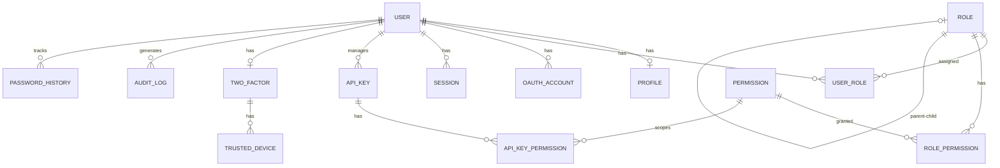

# Database Schema Documentation

Complete reference for all database entities in the Auth Starter Kit.

## Overview

The database schema is designed with **modularity**, **security**, and **extensibility** in mind. All entities use **UUID** primary keys and include timestamp tracking.

## Entity Relationship Diagram



## Entity Categories

### User Management
- **[User](./schema/entities/user.md)** - Core user account with authentication data
- **[Profile](./schema/entities/profile.md)** - Extended user information (name, avatar, phone)
- **[PasswordHistory](./schema/entities/password-history.md)** - Password change tracking

### Authorization
- **[Role](./schema/entities/role.md)** - User roles with hierarchical support
- **[Permission](./schema/entities/permission.md)** - Granular permissions (resource:action)
- **[UserRole](./schema/entities/user-role.md)** - User-role assignments junction table
- **[RolePermission](./schema/entities/role-permission.md)** - Role-permission mappings junction table

### Authentication
- **[Session](./schema/entities/session.md)** - Active user sessions with device tracking
- **[OAuthAccount](./schema/entities/oauth.md)** - Social login provider accounts
- **[TwoFactor](./schema/entities/two-factor.md)** - Two-factor authentication settings
- **[TrustedDevice](./schema/entities/trusted-device.md)** - Trusted devices for 2FA bypass

### API Access
- **[ApiKey](./schema/entities/api-key.md)** - API keys for programmatic access
- **[ApiKeyPermission](./schema/entities/api-key-permission.md)** - API key permission scoping

### Security & Audit
- **[AuditLog](./schema/entities/audit-log.md)** - Comprehensive audit trail
- **[PasswordHistory](./schema/entities/password-history.md)** - Password reuse prevention

## Quick Reference

| Entity | Purpose | Key Fields | Key Relations |
|--------|---------|------------|---------------|
| **User** | Main user account | email, passwordHash, emailVerified | Profile, Roles, Sessions |
| **Profile** | User profile info | firstName, lastName, avatarUrl | User |
| **Role** | Access control roles | name, priority, parentId | Users, Permissions, Children |
| **Permission** | Granular permissions | resource, action | Roles, ApiKeys |
| **Session** | Active sessions | refreshToken, expiresAt, deviceType | User |
| **OAuthAccount** | Social logins | provider, providerAccountId | User |
| **TwoFactor** | 2FA settings | secret, isEnabled, preferredMethod | User, TrustedDevices |
| **ApiKey** | API access keys | keyHash, keyPrefix, rateLimit | User, Permissions |
| **AuditLog** | Audit trail | action, resource, status | User |
| **PasswordHistory** | Password tracking | passwordHash | User |

## Common Patterns

### UUID Primary Keys
All entities use UUID v4 for primary keys:
```typescript
@PrimaryGeneratedColumn('uuid')
id: string;
```

**Benefits:**
- Difficult to enumerate/predict
- Better for distributed systems
- No auto-increment race conditions
- Merge-friendly for multi-tenant scenarios

### Timestamps
All entities inherit from `BaseEntity`:
```typescript
@CreateDateColumn()
createdAt: Date;

@UpdateDateColumn()
updatedAt: Date;
```

### Soft Deletes
Currently not implemented but can be added via:
```typescript
@DeleteDateColumn()
deletedAt?: Date;
```

## Design Decisions

### 1. Why Separate Profile Entity?
- **Performance**: User entity stays lean for authentication queries
- **Flexibility**: Profile fields can be nullable without cluttering User
- **Extensibility**: Easy to add custom fields without migration complexity

### 2. Hierarchical Roles
Roles support parent-child relationships for inheritance:
```
super_admin (priority: 100)
  └─> admin (priority: 80)
      └─> manager (priority: 50)
          └─> user (priority: 10)
```

### 3. Resource-Action Permissions
Permissions use `resource:action` pattern:
- `users:read` - View users
- `users:write` - Create/update users
- `users:delete` - Delete users
- `settings:admin` - Admin settings

### 4. Session Fingerprinting
Sessions track device fingerprints to detect suspicious activity:
- Hash of User-Agent + IP partial
- Prevents session hijacking
- Enables "trusted device" features

### 5. API Key Scoping
API keys can have limited permissions (subset of user's permissions):
- Per-key rate limiting
- IP whitelisting/blacklisting
- Expiration and auto-renewal

## Indexes Strategy

### Performance Indexes
```sql
-- User lookups
CREATE UNIQUE INDEX idx_users_email ON users(email);

-- Session queries
CREATE INDEX idx_sessions_user_id ON sessions(user_id);
CREATE INDEX idx_sessions_refresh_token ON sessions(refresh_token);

-- Audit queries
CREATE INDEX idx_audit_logs_user_id ON audit_logs(user_id);
CREATE INDEX idx_audit_logs_action ON audit_logs(action);
CREATE INDEX idx_audit_logs_created_at ON audit_logs(created_at);

-- OAuth lookups
CREATE UNIQUE INDEX idx_oauth_provider_account ON oauth_accounts(provider, provider_account_id);
```

### Composite Indexes
```sql
-- Permission uniqueness
CREATE UNIQUE INDEX idx_permissions_resource_action ON permissions(resource, action);
```

## Data Types

| TypeORM Type | PostgreSQL Type | Usage |
|--------------|-----------------|-------|
| `uuid` | UUID | Primary keys, foreign keys |
| `varchar(N)` | VARCHAR(N) | Fixed-length strings |
| `text` | TEXT | Unlimited text |
| `boolean` | BOOLEAN | True/false flags |
| `int` | INTEGER | Counters, priorities |
| `timestamp` | TIMESTAMP | Dates and times |
| `json` | JSONB | Flexible data storage |

## Migration Strategy

### Creating Migrations
```bash
# Generate migration from entity changes
npm run migration:generate -- src/database/migrations/AddUserEntity

# Create empty migration
npm run migration:create -- src/database/migrations/AddCustomIndex

# Run migrations
npm run migration:run

# Revert last migration
npm run migration:revert
```

### Migration Best Practices
1. **Never modify existing migrations** - Create new ones
2. **Always test rollback** - Ensure `down()` method works
3. **Data migrations separate** - Keep schema and data migrations separate
4. **Backup before production** - Always backup before running migrations

## Security Considerations

### Sensitive Data
- **Passwords**: Hashed with Argon2id/Bcrypt (never stored plain)
- **2FA Secrets**: Encrypted before storage
- **API Keys**: Hashed with SHA256, only shown once
- **Tokens**: Stored hashed in Redis (sessions) or database

### Cascade Deletes
```typescript
// Profile deleted when user is deleted
@OneToOne(() => User, { onDelete: 'CASCADE' })

// Sessions revoked when user is deleted
@OneToMany(() => Session, { onDelete: 'CASCADE' })
```

### Audit Trail
All sensitive actions are logged:
- Login/logout attempts
- Password changes
- 2FA enable/disable
- Role/permission changes
- API key creation/revocation

## Extensibility Guide

### Adding Custom Fields to User
```typescript
// In User entity
@Column({ nullable: true })
customField?: string;

// Run migration
npm run migration:generate -- src/database/migrations/AddCustomFieldToUser
```

### Adding New Permissions
```typescript
// In seed/migration
await permissionRepository.save({
  resource: 'custom_resource',
  action: 'custom_action',
  description: 'Custom permission description',
});
```

### Custom Entities
Follow the pattern:
1. Extend `BaseEntity` for timestamps
2. Use UUID primary keys
3. Add proper indexes
4. Document relationships
5. Create migration
6. Update this documentation

## Performance Tips

### Eager vs Lazy Loading
```typescript
// Eager loading (use sparingly)
@ManyToOne(() => User, { eager: true })
user: User;

// Lazy loading (recommended)
@ManyToOne(() => User)
user: User;

// Manual loading in queries
const user = await userRepository.findOne({
  where: { id },
  relations: ['profile', 'roles'],
});
```

### Pagination
```typescript
const [users, total] = await userRepository.findAndCount({
  skip: (page - 1) * limit,
  take: limit,
  order: { createdAt: 'DESC' },
});
```

### Query Optimization
- Use `select` to limit fields
- Use `relations` instead of multiple queries
- Add indexes for frequently queried fields
- Use Redis cache for read-heavy data

## Database Size Estimates

Based on 10,000 active users:

| Entity | Estimated Rows | Size |
|--------|----------------|------|
| Users | 10,000 | ~2 MB |
| Profiles | 10,000 | ~3 MB |
| Sessions | 50,000 | ~15 MB |
| AuditLogs | 500,000 | ~150 MB |
| Roles | 10 | <1 KB |
| Permissions | 100 | ~10 KB |

**Total estimated DB size**: ~200 MB for 10K users

## Next Steps

- Review [individual entity documentation](./schema/entities/)
- Understand [entity relationships](./schema/entity-relationship.md)
- Learn about [migrations](./schema/migrations.md)
- Explore [customization examples](./examples/extending-entities.md)

---

**Last Updated:** 2024-12-20
**Schema Version:** 1.0.0
