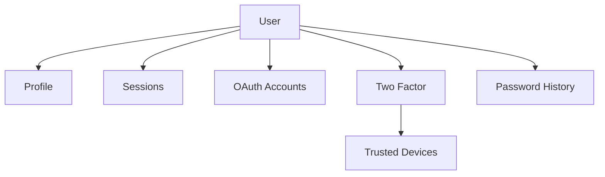
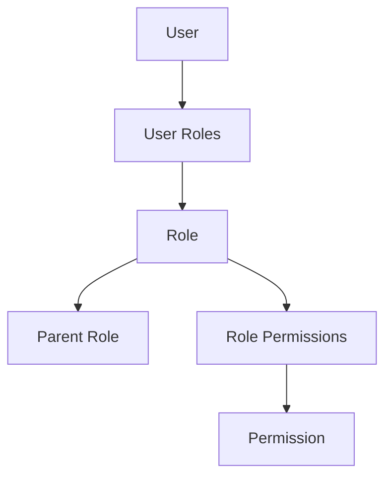
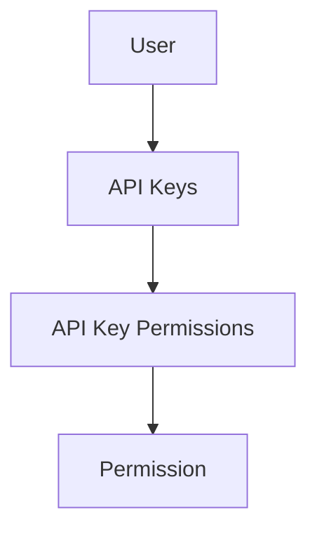
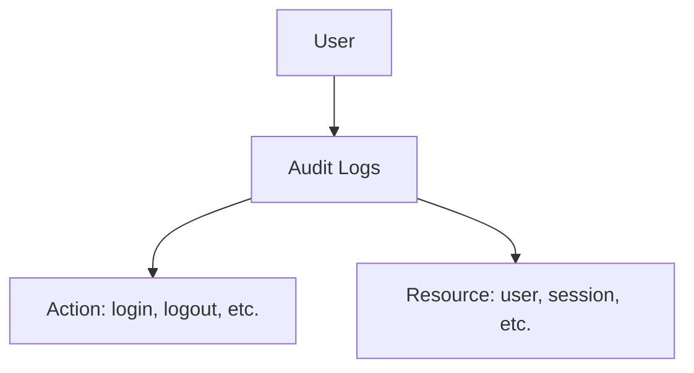

# Entity Relationship Diagram

Visual guide to database entity relationships in the Auth Starter Kit.

## Complete ERD

```mermaid
erDiagram
    USER ||--o| PROFILE : "has one"
    USER ||--o{ USER_ROLE : "has many"
    USER ||--o{ OAUTH_ACCOUNT : "has many"
    USER ||--o{ SESSION : "has many"
    USER ||--o{ API_KEY : "manages"
    USER ||--o| TWO_FACTOR : "has one"
    USER ||--o{ AUDIT_LOG : "generates"
    USER ||--o{ PASSWORD_HISTORY : "tracks"

    ROLE ||--o{ USER_ROLE : "assigned to"
    ROLE ||--o{ ROLE_PERMISSION : "has many"
    ROLE ||--o| ROLE : "parent of"

    PERMISSION ||--o{ ROLE_PERMISSION : "granted to"
    PERMISSION ||--o{ API_KEY_PERMISSION : "scopes"

    API_KEY ||--o{ API_KEY_PERMISSION : "has many"

    TWO_FACTOR ||--o{ TRUSTED_DEVICE : "has many"

    USER {
        uuid id PK
        string email UK
        timestamp emailVerified
        string passwordHash
        int failedAttempts
        timestamp lockedUntil
        timestamp createdAt
        timestamp updatedAt
    }

    PROFILE {
        uuid id PK
        uuid userId FK
        string firstName
        string lastName
        string avatarUrl
        string phone
        boolean phoneVerified
        timestamp createdAt
        timestamp updatedAt
    }

    ROLE {
        uuid id PK
        string name UK
        text description
        uuid parentId FK
        int priority
        timestamp createdAt
        timestamp updatedAt
    }

    PERMISSION {
        uuid id PK
        string resource
        string action
        text description
        timestamp createdAt
        timestamp updatedAt
    }

    USER_ROLE {
        uuid userId PK_FK
        uuid roleId PK_FK
        uuid assignedBy
        timestamp assignedAt
    }

    ROLE_PERMISSION {
        uuid roleId PK_FK
        uuid permissionId PK_FK
    }

    OAUTH_ACCOUNT {
        uuid id PK
        uuid userId FK
        string provider
        string providerAccountId
        text accessToken
        text refreshToken
        timestamp expiresAt
        string scope
        json profileData
        timestamp createdAt
        timestamp updatedAt
    }

    SESSION {
        uuid id PK
        uuid userId FK
        string refreshToken UK
        string fingerprint
        string ipAddress
        string userAgent
        string deviceType
        string browser
        string os
        string location
        timestamp lastActiveAt
        timestamp expiresAt
        timestamp revokedAt
        boolean isTrusted
        timestamp createdAt
    }

    TWO_FACTOR {
        uuid id PK
        uuid userId FK_UK
        string secret
        boolean isEnabled
        timestamp enabledAt
        string[] backupCodes
        string preferredMethod
        string phone
    }

    TRUSTED_DEVICE {
        uuid id PK
        uuid twoFactorId FK
        string fingerprint
        string name
        timestamp trustUntil
        timestamp createdAt
    }

    API_KEY {
        uuid id PK
        uuid userId FK
        string name
        string keyHash UK
        string keyPrefix
        int rateLimit
        int usageCount
        timestamp lastUsedAt
        string[] ipWhitelist
        string[] ipBlacklist
        timestamp expiresAt
        timestamp revokedAt
        boolean autoRenew
        timestamp createdAt
    }

    API_KEY_PERMISSION {
        uuid apiKeyId PK_FK
        uuid permissionId PK_FK
    }

    PASSWORD_HISTORY {
        uuid id PK
        uuid userId FK
        string passwordHash
        timestamp createdAt
    }

    AUDIT_LOG {
        uuid id PK
        uuid userId FK
        string action
        string resource
        string resourceId
        string ipAddress
        string userAgent
        json metadata
        string status
        timestamp createdAt
    }
```

## Relationship Types

### One-to-One Relationships

#### User → Profile
- **Type:** One-to-One
- **Cardinality:** User has exactly one Profile
- **Cascade:** Profile deleted when User is deleted
- **Foreign Key:** `Profile.userId` references `User.id`

```typescript
// User entity
@OneToOne(() => Profile, (profile) => profile.user, { cascade: true })
profile: Profile;

// Profile entity
@OneToOne(() => User, (user) => user.profile, { onDelete: 'CASCADE' })
@JoinColumn({ name: 'userId' })
user: User;
```

#### User → TwoFactor
- **Type:** One-to-One
- **Cardinality:** User has zero or one TwoFactor
- **Cascade:** TwoFactor deleted when User is deleted
- **Foreign Key:** `TwoFactor.userId` references `User.id`

---

### One-to-Many Relationships

#### User → Sessions
- **Type:** One-to-Many
- **Cardinality:** User can have multiple Sessions
- **Cascade:** Sessions deleted when User is deleted
- **Foreign Key:** `Session.userId` references `User.id`
- **Business Rule:** Max 5 concurrent sessions per user (configurable)

#### User → OAuthAccounts
- **Type:** One-to-Many
- **Cardinality:** User can link multiple OAuth providers
- **Cascade:** OAuth accounts deleted when User is deleted
- **Foreign Key:** `OAuthAccount.userId` references `User.id`
- **Business Rule:** One account per provider per user

#### User → ApiKeys
- **Type:** One-to-Many
- **Cardinality:** User can create multiple API keys
- **Cascade:** API keys deleted when User is deleted
- **Foreign Key:** `ApiKey.userId` references `User.id`

#### User → PasswordHistory
- **Type:** One-to-Many
- **Cardinality:** User has history of password changes
- **Cascade:** History deleted when User is deleted
- **Foreign Key:** `PasswordHistory.userId` references `User.id`
- **Business Rule:** Keep last 5 passwords

#### User → AuditLogs
- **Type:** One-to-Many
- **Cardinality:** User generates multiple audit logs
- **Cascade:** Set NULL (preserve logs after user deletion)
- **Foreign Key:** `AuditLog.userId` references `User.id`

#### TwoFactor → TrustedDevices
- **Type:** One-to-Many
- **Cardinality:** 2FA can have multiple trusted devices
- **Cascade:** Trusted devices deleted when 2FA is deleted
- **Foreign Key:** `TrustedDevice.twoFactorId` references `TwoFactor.id`

#### Role → Role (Self-Referencing)
- **Type:** One-to-Many (Hierarchical)
- **Cardinality:** Role can have parent and children
- **Cascade:** None (prevent accidental deletion)
- **Foreign Key:** `Role.parentId` references `Role.id`

---

### Many-to-Many Relationships

#### User ↔ Role (via UserRole)
- **Type:** Many-to-Many
- **Junction Table:** `user_roles`
- **Composite Primary Key:** `(userId, roleId)`
- **Additional Fields:** `assignedBy`, `assignedAt`
- **Business Rule:** User can have multiple roles

```typescript
// UserRole junction entity
@Entity('user_roles')
export class UserRole {
  @PrimaryColumn('uuid')
  userId: string;

  @PrimaryColumn('uuid')
  roleId: string;

  @Column({ type: 'uuid', nullable: true })
  assignedBy: string | null;

  @CreateDateColumn()
  assignedAt: Date;
}
```

#### Role ↔ Permission (via RolePermission)
- **Type:** Many-to-Many
- **Junction Table:** `role_permissions`
- **Composite Primary Key:** `(roleId, permissionId)`
- **Business Rule:** Role can have multiple permissions

```typescript
// RolePermission junction entity
@Entity('role_permissions')
export class RolePermission {
  @PrimaryColumn('uuid')
  roleId: string;

  @PrimaryColumn('uuid')
  permissionId: string;
}
```

#### ApiKey ↔ Permission (via ApiKeyPermission)
- **Type:** Many-to-Many
- **Junction Table:** `api_key_permissions`
- **Composite Primary Key:** `(apiKeyId, permissionId)`
- **Business Rule:** API key permissions are subset of user's permissions

---

## Relationship Diagrams by Feature

### Authentication Flow



### Authorization Flow



### API Access Flow



### Audit Flow



---

## Cascade Behaviors

| Parent → Child | Cascade Type | Behavior |
|----------------|--------------|----------|
| User → Profile | CASCADE | Delete profile when user deleted |
| User → Sessions | CASCADE | Delete all sessions when user deleted |
| User → OAuthAccounts | CASCADE | Delete OAuth accounts when user deleted |
| User → ApiKeys | CASCADE | Delete API keys when user deleted |
| User → TwoFactor | CASCADE | Delete 2FA when user deleted |
| User → PasswordHistory | CASCADE | Delete history when user deleted |
| User → AuditLogs | SET NULL | Keep logs but remove user reference |
| Role → UserRole | CASCADE | Remove role assignments when role deleted |
| Role → RolePermission | CASCADE | Remove permissions when role deleted |
| Permission → RolePermission | CASCADE | Remove from roles when permission deleted |
| TwoFactor → TrustedDevices | CASCADE | Delete trusted devices when 2FA deleted |

---

## Unique Constraints

| Entity | Unique Constraint | Purpose |
|--------|------------------|---------|
| User | `email` | One account per email |
| Role | `name` | Unique role names |
| Permission | `(resource, action)` | No duplicate permissions |
| OAuthAccount | `(provider, providerAccountId)` | One provider account per user |
| Session | `refreshToken` | Unique session tokens |
| ApiKey | `keyHash` | Unique API keys |
| TrustedDevice | `(twoFactorId, fingerprint)` | One device fingerprint per 2FA |

---

## Foreign Key Indexes

For optimal query performance, foreign keys are indexed:

```sql
-- User relationships
CREATE INDEX idx_profiles_user_id ON profiles(user_id);
CREATE INDEX idx_sessions_user_id ON sessions(user_id);
CREATE INDEX idx_oauth_accounts_user_id ON oauth_accounts(user_id);
CREATE INDEX idx_api_keys_user_id ON api_keys(user_id);
CREATE INDEX idx_password_history_user_id ON password_history(user_id);
CREATE INDEX idx_audit_logs_user_id ON audit_logs(user_id);

-- Role relationships
CREATE INDEX idx_user_roles_user_id ON user_roles(user_id);
CREATE INDEX idx_user_roles_role_id ON user_roles(role_id);
CREATE INDEX idx_role_permissions_role_id ON role_permissions(role_id);
CREATE INDEX idx_role_permissions_permission_id ON role_permissions(permission_id);

-- API Key relationships
CREATE INDEX idx_api_key_permissions_api_key_id ON api_key_permissions(api_key_id);
CREATE INDEX idx_api_key_permissions_permission_id ON api_key_permissions(permission_id);

-- 2FA relationships
CREATE INDEX idx_trusted_devices_two_factor_id ON trusted_devices(two_factor_id);
```

---

## Circular Dependencies

### None Present
The schema is designed to avoid circular dependencies. The only self-referencing relationship is:
- **Role → Role** (parent-child hierarchy)

This is intentional and managed carefully to prevent infinite loops.

---

## Relationship Best Practices

### 1. Always Use Cascade Appropriately
- Use `CASCADE` for owned relationships (Profile, Sessions)
- Use `SET NULL` for audit trails
- Avoid `CASCADE` for many-to-many relationships (use junction tables)

### 2. Index Foreign Keys
All foreign keys should have indexes for query performance.

### 3. Enforce Referential Integrity
Database-level constraints ensure data consistency.

### 4. Use Soft Deletes When Needed
For entities like Users, consider soft deletes:
```typescript
@DeleteDateColumn()
deletedAt?: Date;
```

---

## Next Steps

- Review individual [entity documentation](./entities/)
- Understand [database schema](../DATABASE.md)
- Learn about [migrations](./migrations.md)

---

**Last Updated:** 2024-12-20
**Schema Version:** 1.0.0
